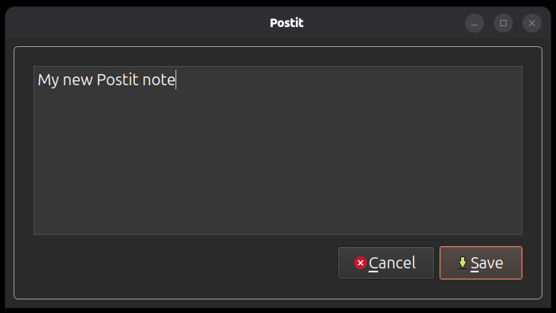

# Postit

A one-dialog utility for jotting a quick note — the software equivalent of a
sticky note. Launch it, type, click **Save**, and the text lands in a
timestamped markdown file with YAML frontmatter. There is no main window and no
state to manage: the dialog is the whole application, and the process exits as
soon as the note is written.

It is a PyQt6 rewrite of an earlier bash + zenity version, with the same file
format and the same date handling. The one behavior change is that the old
version's "Note saved" desktop notification is gone — saving is silent.



## Running

```bash
./start.sh [NOTES_DIR]
```

`NOTES_DIR` is where notes get written, and defaults to `~/ferguson`. The
directory is created on first save if it doesn't exist yet.

`start.sh` runs the app through [uv](https://docs.astral.sh/uv/), which creates
and refreshes the virtualenv from `pyproject.toml` on every run — there is no
install step and nothing to activate. You need Python 3.11+ and `uv` on your
PATH, plus the sibling checkout described next.

### The `windowchrome` sibling project

Postit's colored title bar and window border come from
**[windowchrome](https://github.com/<your-account>/windowchrome)**, a small
reusable PyQt6 library kept in its own repository so several apps can wear the
same chrome. It is **not on PyPI**: `pyproject.toml` resolves it by path, from a
directory sitting *beside* this one.

```bash
cd ..                      # the directory holding Postit/
git clone https://github.com/<your-account>/windowchrome.git
```

giving:

```
projects/
├── Postit/
└── windowchrome/          <- must be a sibling, and named this
```

If it is missing, `./start.sh` fails immediately with an unresolved path
dependency rather than with anything subtle. The checkout is used in place —
`uv` installs it editable, so there is nothing to build and an edit there is
live here on the next run.

## Installing the desktop icon

```bash
./install.sh
```

It prompts for two paths — the program directory (defaults to where the script
lives) and the notes directory (defaults to `~/ferguson`) — and bakes both into
`~/.local/share/applications/postit.desktop`, so the launcher entry runs
`start.sh` with your notes directory as its argument. To change the notes
directory later, just run `install.sh` again.

`./uninstall.sh` removes the desktop entry.

## The dialog

A text area and two buttons.

| Action | Result |
|---|---|
| **Save** | Writes the note and exits. Disabled while the box is empty or whitespace-only. |
| **Cancel** or `Esc` | Exits without writing anything. |
| `Enter` | Inserts a newline — always. There is no keyboard save shortcut, by design. |

## The note template

Each note is `note-template.md` with three placeholders substituted:

```markdown
---
tags:
  - p3
  - todo
due: {date}
start: {time}
---
{content}
```

| Placeholder | Replaced with | Example |
|---|---|---|
| `{date}` | Today's date, month and day unpadded | `8/21/2026` |
| `{time}` | The current time, 12-hour, hour unpadded | `1:05 PM` |
| `{content}` | Exactly what you typed | |

Edit `note-template.md` to change the frontmatter — different tags, extra
fields, no frontmatter at all. It's read fresh on every save, so changes take
effect immediately with no restart.

`{date}` and `{time}` use those slash-and-AM/PM formats for compatibility with
the Timex Extension, which is why they don't match the filename's timestamp.
Substitution is literal, so note text containing `&`, backslashes, or even the
string `{date}` is written through untouched.

## Output files

Notes are named `note-YYYY-MM-DD--HH-MM-SS.md` — no slashes, spaces or colons,
so they sort chronologically and are painless to type at a shell. If two notes
land inside the same second, the second one gets a `-2` suffix
(`note-2026-08-21--13-05-07-2.md`) rather than overwriting the first.

## Layout

| Path | What it is |
|---|---|
| `postit/note.py` | Timestamps, template rendering, the file write. No Qt — runs headless. |
| `postit/dialog.py` | `NoteDialog` and its theme-derived styling. |
| `postit/__main__.py` | Entry point: argparse, `QApplication`, error dialogs. |
| `note-template.md` | The template described above. Yours to edit. |
| `start.sh` | Launcher; runs the app via `uv`. |
| `install.sh` / `uninstall.sh` | Desktop entry management. |
| `postit.desktop` | Desktop entry template; `install.sh` rewrites `Exec=` and `Icon=`. |

See [USER_GUIDE.md](/docs/USER_GUIDE.md) for a walkthrough aimed at using the app rather than
working on it.
